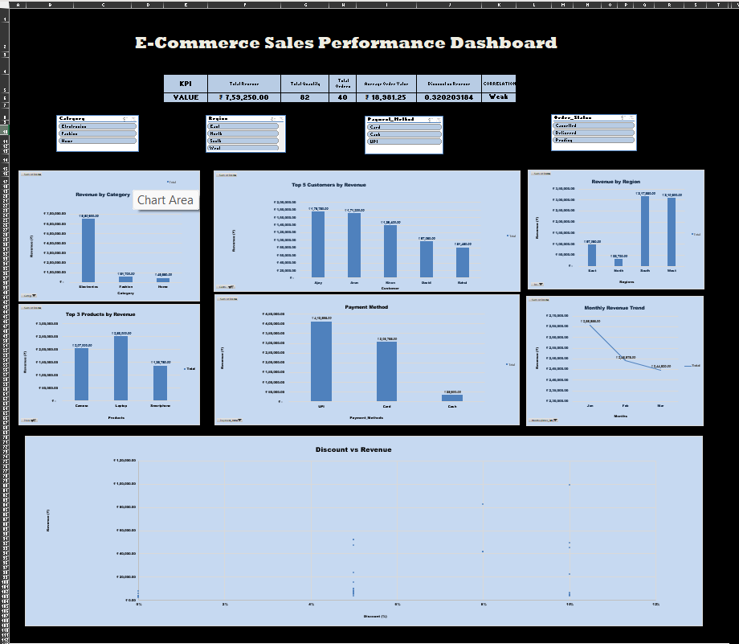

E-Commerce Sales Analysis & Dashboard – Excel

📊 Project Overview

This project presents an **E-Commerce Sales Analysis and Interactive Dashboard** developed using Microsoft Excel.

The project analyzes e-commerce order data to understand **sales performance, product performance, customer contribution, regional sales, payment methods, order status, and discount impact**.

The dashboard provides an interactive way to explore the data using **PivotTables, Pivot Charts, KPI cards, and slicers**.

---

🛠️ Tools & Technologies

* Microsoft Excel
* Excel Formulas
* Excel Tables
* PivotTables
* Pivot Charts
* Slicers
* Data Analysis
* Data Visualization

---

📁 Dataset

The dataset contains **40 e-commerce orders** with information including:

* Order ID
* Order Date
* Customer
* City
* Region
* Category
* Product
* Quantity
* Unit Price
* Discount
* Payment Method
* Order Status
* Revenue

---

📌 Key KPIs

| KPI                          |         Value |
| ---------------------------- | ------------: |
| Total Revenue                |     ₹7,59,250 |
| Total Quantity               |            82 |
| Total Orders                 |            40 |
| Average Order Value          |    ₹18,981.25 |
| Discount–Revenue Correlation |          0.32 |
| Relationship                 | Weak Positive |

---

📈 Dashboard Features

The interactive dashboard includes:

1. Revenue by Category

Analyzes revenue generated by different product categories.

2. Monthly Revenue Trend

Shows how revenue changes over time and helps identify monthly sales patterns.

3. Revenue by Region

Compares sales performance across different regions.

4. Top 3 Products

Identifies the products contributing the highest revenue.

5. Top 5 Customers

Highlights customers with the highest revenue contribution.

6. Revenue by Payment Method

Analyzes revenue generated through different payment methods.

7. Order Status Analysis

Shows revenue distribution across order statuses such as Delivered, Pending, and Cancelled.

8. Discount vs Revenue

Examines the relationship between discount percentage and revenue using correlation analysis.

9. Interactive Slicers

Users can filter the dashboard by:

* Category
* Region
* Payment Method
* Order Status

---

## 📊 Excel Analysis

The project uses several Excel functions and features, including:

* SUM
* AVERAGE
* MIN
* MAX
* COUNTA
* SUMIF
* SUMIFS
* COUNTIF
* COUNTIFS
* AVERAGEIF
* IF
* AND
* OR
* TEXT
* MONTH
* YEAR
* XLOOKUP
* INDEX & MATCH
* LEFT
* RIGHT
* MID
* LEN
* TRIM
* TEXTJOIN
* IFERROR
* Excel Tables
* PivotTables
* Pivot Charts
* Slicers

---

## 📂 Project Structure

   text
ecommerce-sales-excel-dashboard/
│
├── README.md
├── ecommerce_orders.xlsx
│
└── screenshots/
    └── dashboard.png

### Excel Workbook Structure

The workbook is organized into:

**Orders**

* Raw e-commerce order data

**Analysis**

* PivotTables
* Supporting calculations
* Detailed analysis

**Dashboard**

* KPI cards
* Charts
* Slicers
* Interactive visualizations

---

## 🔎 Key Insights

* Electronics generated the largest share of revenue in the dataset.
* A small number of products contributed a significant portion of total revenue.
* Revenue performance varies across regions.
* UPI and Card payments account for most of the recorded revenue.
* The calculated discount–revenue correlation is **0.32**, indicating a **weak positive linear relationship** in this dataset.
* Customer-level analysis helps identify the customers contributing the most revenue.

> Note: These observations are based on the 40-order dataset used in this project and should not be generalized to the wider e-commerce market.

---

## 🎯 Project Objectives

The main objectives of this project were to:

1. Analyze e-commerce sales data.
2. Calculate important business KPIs.
3. Identify high-performing products and customers.
4. Compare revenue across categories and regions.
5. Analyze payment methods and order statuses.
6. Study monthly sales trends.
7. Explore the relationship between discounts and revenue.
8. Build an interactive Excel dashboard for business analysis.

---

## 📷 Dashboard Preview

---

## 💡 Skills Demonstrated

This project demonstrates practical skills in:

* Data Cleaning
* Data Analysis
* Excel Formulas
* Business KPI Analysis
* PivotTable Analysis
* Data Visualization
* Dashboard Development
* Interactive Filtering
* Basic Statistical Analysis
* Business Insight Generation

---

## 👨‍💻 Author

**AJAY GADIDHA**

B.Tech Computer Science and Engineering Student

Interested in **Data Analytics, SQL, Excel, Power BI, and Python**.

